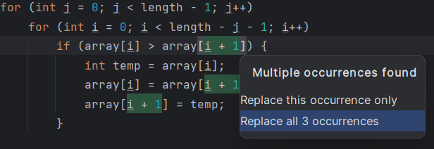
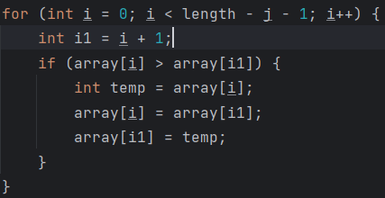

## 변수 추출(Extract Variable)
Extract Variable은 식(expression)을 추출하여 변수에 저장합니다.
중복된 식이 여러 곳에 있거나 특정 식이 이해하기 어려워 추가적인 의미를 설명할 때 사용할 수 있습니다.

## Extract Variable Refactoring 단축키
`Ctrl` + `Alt` + `V`

## Extract Variable 사용법
1. 추출할 식을 블럭 지정합니다.
2. `Ctrl` + `Alt` + `V`을 눌러 Extract Variable 기능을 사용합니다.  
   
3. 같은 식을 사용하는 모든 곳을 변경하고 싶으면 `Replace all N occurences`에서 `Enter`를 누릅니다.  
   

## 참고 문서 
- IdeaLearningProject
- https://www.jetbrains.com/help/idea/extract-variable.html
